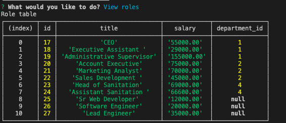
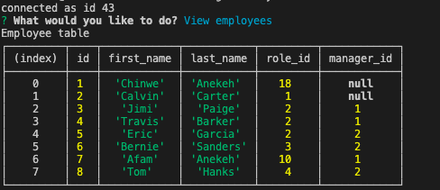

# Content-Management-System

# Table of Contents  

* [Discription](#discription)
* [Installation](#installation)
* [Screenshot](#screenshot)   
* [Contacts](#contacts)
* [Programming-Language](#programming-language)

## Discription   

This is a node application that makes it easy for company to manage employee accounts, departments and roles, that are stored in MySQL database. Users can add departments, roles, and employes. They can view/update departments, roles, and employees. 

## Installation 

1. Clone the repo: https://github.com/Afam-26/ReadMe-Generator.git
2. Install NPM packages: npm i inquirer, MySQL
3. To run program: node index.js

## Screenshot

[Click here for the video link](https://drive.google.com/file/d/1v0_m5qBjAkHcLmp_DahT-S7FSrtO4Qx7/view?usp=sharing)

 
## Contacts Info

Please reach out to me if you have any questions.

Email: afam262@gmail.com

Github Username: https://afam-26.github.io/

[Github link]() 

## Programming-Language 
\`\`\`

    Node

    Inquirer 

    MySQL 
\`\`\`